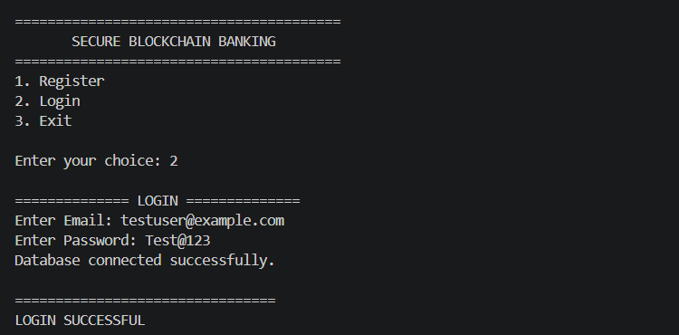
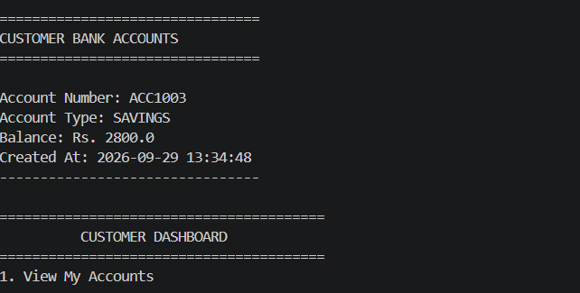
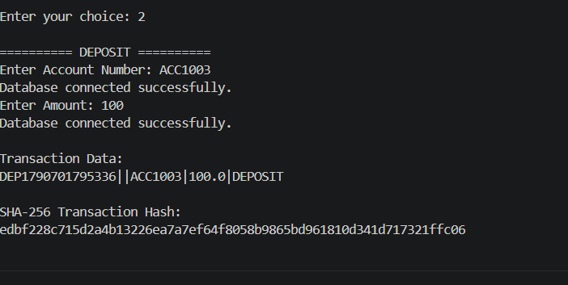
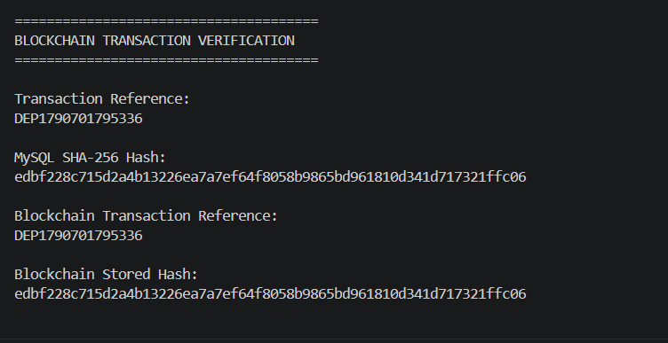

# Secure Blockchain-Based Banking Transaction System

A Java-based banking transaction system that combines MySQL database management with blockchain-based transaction integrity verification.

This project demonstrates how traditional banking operations can be integrated with blockchain technology to provide an additional layer of transaction integrity and verification.

> **Note:** This is an academic/portfolio project developed for learning and demonstration purposes. It is not connected to any real banking system or financial institution.

---

## Overview

The Secure Blockchain-Based Banking Transaction System is designed to simulate basic banking operations while using blockchain technology to verify the integrity of transaction records.

The system uses:

- **Java** for application logic
- **MySQL** for customer, account, and transaction data
- **JDBC** for database communication
- **BCrypt** for password hashing
- **SHA-256** for transaction hash generation
- **Solidity** for the blockchain smart contract
- **Hardhat** for a local Ethereum-compatible blockchain
- **Web3j** for communication between Java and the blockchain

The project demonstrates how a transaction can be recorded in a relational database while its hash is also stored on a blockchain.

---

## Features

### Customer Management

- Customer registration
- Customer login
- BCrypt password hashing
- Login validation
- Customer-specific account access

### Banking Operations

- View customer accounts
- Deposit money
- Withdraw money
- Fund transfer
- Balance validation
- Insufficient balance checking
- Same-account transfer prevention
- Receiver account validation
- Transaction history

### Security

- BCrypt password hashing
- SHA-256 transaction hashing
- PreparedStatements to reduce SQL injection risk
- Account ownership verification
- Environment variables for sensitive credentials
- Blockchain-based transaction integrity verification

### Blockchain Integration

- Solidity smart contract
- Local Hardhat blockchain
- Java-to-blockchain communication using Web3j
- Transaction hash storage on blockchain
- Blockchain transaction verification
- Duplicate transaction-reference prevention

---

## Technologies Used

| Technology | Purpose |
|---|---|
| Java 21 | Application development |
| OOP | Application design |
| JDBC | Java-MySQL communication |
| MySQL | Database management |
| BCrypt | Password hashing |
| SHA-256 | Transaction hashing |
| Solidity | Smart contract development |
| Hardhat | Local blockchain |
| Web3j | Java-blockchain integration |
| Maven | Java dependency management |
| npm | Blockchain project dependencies |
| Git | Version control |
| GitHub | Source code hosting |
| VS Code | Development environment |
| Remix IDE | Smart contract development/testing |
| MetaMask | Blockchain wallet/testing |

---

## System Architecture

```text
                 ┌───────────────────────────┐
                 │      Java Application     │
                 │                           │
                 │  Registration / Login     │
                 │  Deposit / Withdrawal     │
                 │  Fund Transfer            │
                 │  Transaction History       │
                 │  Blockchain Verification  │
                 └─────────────┬─────────────┘
                               │
                 ┌─────────────┴─────────────┐
                 │                           │
                 ▼                           ▼
        ┌─────────────────┐       ┌────────────────────┐
        │      MySQL      │       │   Web3j / Java     │
        │                 │       │ Blockchain Layer   │
        │ Customers       │       └─────────┬──────────┘
        │ Accounts        │                 │
        │ Transactions    │                 ▼
        └─────────────────┘       ┌────────────────────┐
                                  │ Solidity Contract  │
                                  │                    │
                                  │ Transaction Record  │
                                  │ Transaction Hash    │
                                  │ Timestamp           │
                                  │ Recorded By         │
                                  └─────────┬──────────┘
                                            │
                                            ▼
                                  ┌────────────────────┐
                                  │  Hardhat Local     │
                                  │     Blockchain      │
                                  └────────────────────┘
```

---

## Project Structure

```text
SecureBlockchainBanking/
│
├── blockchain/
│   └── BankingTransaction.sol
│
├── contracts/
│   └── BankingTransaction.sol
│
├── ignition/
│   └── modules/
│       └── BankingTransaction.ts
│
├── scripts/
│   └── send-op-tx.ts
│
├── screenshots/
│   ├── login.png
│   ├── dashboard.png
│   ├── transaction.png
│   ├── blockchain-verification.png
│   └── github.png
│
├── src/
│   ├── Main.java
│   ├── Account.java
│   ├── Bank.java
│   ├── Transaction.java
│   ├── DatabaseConnection.java
│   ├── CustomerDAO.java
│   ├── AccountDAO.java
│   ├── TransactionDAO.java
│   ├── BankDAO.java
│   ├── HashUtil.java
│   ├── TransactionVerifier.java
│   ├── BlockchainConnection.java
│   ├── BankingTransactionService.java
│   ├── BlockchainTransactionVerifier.java
│   ├── PasswordUtil.java
│   ├── LoginService.java
│   ├── CustomerAccountService.java
│   ├── DepositService.java
│   ├── WithdrawService.java
│   ├── FundTransferService.java
│   └── TransactionHistoryService.java
│
├── BankingApplication.java
├── pom.xml
├── package.json
├── package-lock.json
├── hardhat.config.ts
├── tsconfig.json
├── .gitignore
└── README.md
```

---

## Database Design

The project uses a MySQL database named:

```text
banking_system
```

### Customers Table

Stores customer registration and authentication information.

```text
customers
├── customer_id
├── full_name
├── email
├── phone
├── password
└── created_at
```

### Accounts Table

Stores bank account information.

```text
accounts
├── account_id
├── customer_id
├── account_number
├── account_type
├── balance
└── created_at
```

### Transactions Table

Stores banking transaction records.

```text
transactions
├── transaction_id
├── transaction_reference
├── sender_account
├── receiver_account
├── transaction_type
├── amount
├── status
├── transaction_hash
└── created_at
```

The `customer_id` connects customers with their accounts.

The transaction table stores the SHA-256 hash that is also recorded on the blockchain.

---

## Blockchain Integration

The project contains a Solidity smart contract named:

```text
BankingTransaction
```

The smart contract records:

- Transaction reference
- Transaction hash
- Timestamp
- Blockchain address that recorded the transaction

### Smart Contract Flow

```text
Java Banking Operation
        │
        ▼
Generate Transaction Reference
        │
        ▼
Create Transaction Data
        │
        ▼
Generate SHA-256 Hash
        │
        ▼
Send Reference + Hash
        │
        ▼
Solidity Smart Contract
        │
        ▼
Hardhat Local Blockchain
```

The blockchain stores the transaction hash rather than the customer's sensitive banking information.

---

## Transaction Integrity Verification

When a banking transaction is created, the application generates a SHA-256 hash.

Example:

```text
Transaction Data
       │
       ▼
SHA-256
       │
       ▼
Transaction Hash
       │
       ├──────────────► MySQL
       │
       └──────────────► Blockchain
```

During verification:

```text
MySQL Transaction Hash
          │
          ▼
Compare With
          │
          ▼
Blockchain Transaction Hash
          │
          ▼
Match?
   ┌──────┴──────┐
   │             │
  YES            NO
   │             │
   ▼             ▼
Integrity      Verification
Verified       Failed
```

If the hashes match, the application reports that the transaction integrity has been verified.

---

## Security Features

### 1. BCrypt Password Hashing

Customer passwords are not stored as plain text.

The project uses BCrypt:

```java
BCrypt.hashpw(password, BCrypt.gensalt(12));
```

During login, the entered password is compared against the stored BCrypt hash.

---

### 2. SHA-256 Transaction Hashing

Transaction data is converted into a SHA-256 hash before being stored.

This provides a way to detect changes to the transaction data during verification.

---

### 3. PreparedStatements

Database operations use JDBC `PreparedStatement` objects instead of directly concatenating user input into SQL queries.

This helps reduce SQL injection risks.

---

### 4. Account Ownership Verification

Before performing account operations, the system verifies that the logged-in customer owns the account.

For example:

```text
Logged-in Customer
        │
        ▼
Account Ownership Check
        │
   ┌────┴────┐
   │         │
 Valid     Invalid
   │         │
   ▼         ▼
Allow      Deny
Operation  Operation
```

---

### 5. Environment Variables

Sensitive configuration such as database credentials and blockchain private keys are loaded through environment variables rather than being hardcoded into source code.

Example:

```text
MYSQL_PASSWORD
HARDHAT_PRIVATE_KEY
```

Sensitive files and credentials are excluded through `.gitignore`.

---

## Banking Transaction Flow

### Deposit

```text
Customer Login
      │
      ▼
Account Ownership Check
      │
      ▼
Validate Amount
      │
      ▼
Update MySQL Balance
      │
      ▼
Generate Transaction Reference
      │
      ▼
Generate SHA-256 Hash
      │
      ▼
Record Hash on Blockchain
      │
      ▼
Store Transaction in MySQL
      │
      ▼
Commit Transaction
```

### Withdrawal

```text
Customer Login
      │
      ▼
Account Ownership Check
      │
      ▼
Check Available Balance
      │
      ▼
Update Balance
      │
      ▼
Generate Transaction Hash
      │
      ▼
Record Hash on Blockchain
      │
      ▼
Store Transaction in MySQL
      │
      ▼
Commit Transaction
```

### Fund Transfer

```text
Customer Login
      │
      ▼
Verify Sender Ownership
      │
      ▼
Verify Receiver Account
      │
      ▼
Check Sender Balance
      │
      ▼
Debit Sender
      │
      ▼
Credit Receiver
      │
      ▼
Generate SHA-256 Hash
      │
      ▼
Record Hash on Blockchain
      │
      ▼
Store Transaction in MySQL
      │
      ▼
Commit Transaction
```

---

## Validation & Testing

The following application scenarios were tested during development:

- Customer registration
- Customer login
- Correct password authentication
- Incorrect password rejection
- Unknown email rejection
- Account ownership validation
- Account viewing
- Deposit validation
- Invalid deposit amount
- Withdrawal validation
- Insufficient balance handling
- Fund transfer
- Invalid receiver account handling
- Same-account transfer prevention
- Transaction history
- Blockchain transaction recording
- Blockchain transaction verification
- SHA-256 hash comparison
- Logout functionality
- MySQL database connectivity
- Hardhat local blockchain connectivity

Example successful verification:

```text
HASH VERIFICATION SUCCESSFUL

MySQL hash matches blockchain hash.

Transaction integrity verified.
```

---

## Screenshots

### Login / Main Menu



### Customer Dashboard



### Successful Transaction



### Blockchain Transaction Verification



### GitHub Repository


---

## Setup / Installation

### Prerequisites

Install the following:

- JDK 21
- MySQL 8.x
- Node.js
- npm
- Maven
- Git
- VS Code

---

### 1. Clone the Repository

```bash
git clone https://github.com/arunkumardev-07/SecureBlockchainBanking.git
```

Navigate into the project:

```bash
cd SecureBlockchainBanking
```

---

### 2. Create the MySQL Database

Open MySQL and create:

```sql
CREATE DATABASE banking_system;
```

Then create the required tables:

```sql
USE banking_system;
```

Create the `customers`, `accounts`, and `transactions` tables according to the database schema used by the project.

---

### 3. Configure MySQL Password

Set the MySQL password as an environment variable.

### Windows PowerShell

```powershell
$env:MYSQL_PASSWORD="YOUR_MYSQL_PASSWORD"
```

Do not commit the password to GitHub.

---

### 4. Install Java Dependencies

Run:

```powershell
mvn clean compile
```

---

### 5. Install Blockchain Dependencies

Run:

```powershell
npm install
```

---

### 6. Start Hardhat Local Blockchain

Open a terminal:

```powershell
npx hardhat node
```

Keep this terminal running.

---

### 7. Deploy the Smart Contract

Open another terminal in the project directory:

```powershell
npx hardhat ignition deploy ignition/modules/BankingTransaction.ts --network localhost
```

After deployment, note the contract address.

If the contract address changes, update the address in the Java blockchain service classes.

---

### 8. Configure Blockchain Private Key

In the second terminal, set the Hardhat account private key as an environment variable.

```powershell
$env:HARDHAT_PRIVATE_KEY="YOUR_HARDHAT_ACCOUNT_PRIVATE_KEY"
```

Never commit or share the private key.

---

### 9. Run the Application

Run:

```powershell
mvn exec:java "-Dexec.mainClass=BankingApplication"
```

---

## Main Application Menu

The application provides:

```text
1. Register
2. Login
3. Exit
```

After successful login, the customer dashboard provides:

```text
1. View My Accounts
2. Deposit Money
3. Withdraw Money
4. Fund Transfer
5. Transaction History
6. Verify Blockchain Transaction
7. Logout
```

---

## Environment Variables

The application uses environment variables for sensitive configuration.

```text
MYSQL_PASSWORD
HARDHAT_PRIVATE_KEY
```

These values should never be committed to the repository.

---

## Limitations

This project is designed for academic and portfolio demonstration purposes.

Current limitations include:

- Uses a local Hardhat blockchain
- Does not connect to a real banking network
- Does not process real money
- Does not use a production Ethereum network
- Blockchain and MySQL are separate systems
- Current transaction consistency between MySQL and blockchain can be improved for production environments
- No production-grade authentication or authorization framework
- No frontend web/mobile application

---

## Future Enhancements

Possible future improvements include:

- Improved transaction consistency between MySQL and blockchain
- Spring Boot backend
- REST APIs
- Web-based frontend
- JWT authentication
- Role-based access control
- Production database configuration
- Deployment to a public blockchain testnet
- Smart contract access control
- Event-based blockchain monitoring
- Transaction status reconciliation
- Docker-based deployment
- Automated unit and integration testing
- CI/CD using GitHub Actions

---

## Learning Outcomes

Through this project, the following concepts were practiced:

- Java programming
- Object-Oriented Programming
- JDBC
- MySQL database design
- SQL queries
- Database transactions
- Password hashing
- Cryptographic hashing
- Blockchain fundamentals
- Solidity smart contracts
- Ethereum-compatible blockchain concepts
- Web3j
- Hardhat
- Git and GitHub
- Environment variable management
- Secure software development practices

---

## Author

**Arun Kumar**

B.E. Computer Science and Engineering  
Saveetha Engineering College, Chennai

### Areas of Interest

- Java Development
- Blockchain Development
- Smart Contracts
- Software Development
- Cybersecurity
- Cryptography

---

## License

This project is intended for educational and portfolio purposes.